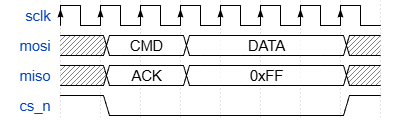
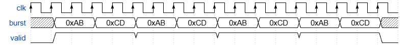
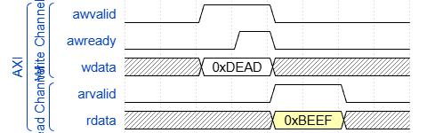
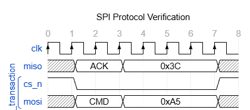

# WaveDSL

WaveDSL compiler — converts WaveDSL source into [WaveDrom](https://wavedrom.com/) JSON.

WaveDSL is a domain-specific language designed for both humans and AI to read and write timing diagrams easily.

## Build

```bash
cargo build --release
```

## Usage

```bash
# File to stdout (JSON)
wavedsl input.wdsl

# File to file
wavedsl input.wdsl -o output.json

# Stdin to stdout
echo 'signal clk clock(8)' | wavedsl
```

JSON output is always pretty-printed.

### SystemVerilog Assertion Output

When the source contains `assert` blocks, a `.sv` file is generated automatically alongside the JSON:

```bash
# JSON -> stdout, SV -> input.sv (auto-named)
wavedsl input.wdsl

# Specify SV output path explicitly
wavedsl input.wdsl --sv output.sv

# Suppress SV output
wavedsl input.wdsl --no-sv
```

## DSL Quick Reference

### Signal

```
signal <name> <wave_expr>...
```

### Group (nest up to 2 levels)

```
group "Label" {
    signal ...
    group "Sub" {
        signal ...
    }
}
```

### Built-in Functions

| Function | Description | Example |
|----------|-------------|---------|
| `clock(n, edge=rising)` | Clock signal | `clock(8)`, `clock(4, edge=falling)` |
| `high(n)` | High level | `high(3)` |
| `low(n)` | Low level | `low(2)` |
| `data(n, label, color=1)` | Bus data | `data(4, "0xAB")`, `data(2, "CMD", color=3)` |
| `x(n)` | Undefined | `x(1)` |
| `z(n)` | Hi-Z | `z(2)` |
| `gap()` | Gap marker | `gap()` |
| `repeat(n, expr...)` | Repeat sequence | `repeat(4, high(1) low(1))` |

### Signal Attributes

```
signal CK  clock(8) period=2
signal CMD x(1) data(2, "RAS") phase=0.5
```

| Attribute | Type | Description |
|-----------|------|-------------|
| `period` | number | Waveform period multiplier |
| `phase` | number | Phase offset |

### Head / Foot

```
head {
    text = "Title"
    tick = 0
    every = 2
}

foot {
    text = "Figure 1"
    tock = 9
}
```

| Key | Type | Description |
|-----|------|-------------|
| `text` | string | Display text |
| `tick` | number | Tick start number |
| `tock` | number | Tock start number |
| `every` | number | Tick/tock display interval |

### Config

```
config {
    hscale = 2
}
```

| Key | Type | Description |
|-----|------|-------------|
| `hscale` | integer | Horizontal scale multiplier |

### Comments

```
// line comment
```

### Assert Blocks (SystemVerilog Assertion Generation)

Assert blocks generate both a WaveDrom timing diagram group **and** a `.sv` file with SystemVerilog concurrent assertions — from the same source.

#### Approach A — wave pattern

The waveform description itself becomes the assertion. The trigger signal is auto-detected.

```
assert "block_name" clock=clk_signal {
    signal sig_a  low(2) high(4) low(2)
    signal sig_b  x(2)   data(4, "0xAB") x(2)
}
```

- Appears in JSON as a named `group`
- Trigger auto-detected from first transition (`$rose`/`$fell`)
- Consecutive identical cycles compressed with `[*N]`
- `data(n, "0xAB")` → exact value check `8'hAB`; non-hex labels → valid-data check

#### Approach B — when/then conditions

Expresses protocol rules as implication conditions.

```
assert "rule_name" clock=clk_signal {
    when sig == high  then other != x
    when $rose(sig)   then ##2 other != x
    when sig == low   then other[*4]
}
```

- Does **not** appear in the timing diagram
- Each `when` generates an independent `property` + `assert property`
- Supports `##N` delay, `[*N]` consecutive repeat, `[->N]` goto repeat, `and`/`or`

#### Condition value keywords

| WaveDSL | SystemVerilog |
|---------|---------------|
| `sig == high` | `sig == 1'b1` |
| `sig == low` | `sig == 1'b0` |
| `sig == x` | `sig === 'x` |
| `sig == z` | `sig === 'z` |
| `sig == data` | `(sig !== 'x && sig !== 'z)` |
| `sig != x` | `sig !== 'x` |
| `$rose(sig)` | `$rose(sig)` |
| `$fell(sig)` | `$fell(sig)` |
| `$stable(sig)` | `$stable(sig)` |

## Examples

### 1. SPI bus

```
signal sclk  clock(8)
signal mosi  x(1) data(2, "CMD") data(4, "DATA") x(1)
signal miso  x(1) data(2, "ACK") data(4, "0xFF") x(1)
signal cs_n  high(1) low(6) high(1)
```

```wavedrom
{
  "signal": [
    { "name": "sclk", "wave": "PPPPPPPP" },
    { "name": "mosi", "wave": "x=.=...x", "data": ["CMD", "DATA"] },
    { "name": "miso", "wave": "x=.=...x", "data": ["ACK", "0xFF"] },
    { "name": "cs_n", "wave": "10.....1" }
  ]
}
```



### 2. Burst transfer (`repeat`)

```
// バースト転送
signal clk   clock(18)
signal burst x(1) repeat(4, data(2, "0xAB") data(2, "0xCD")) x(1)
signal valid low(1) repeat(4, high(4)) low(1)
```

```wavedrom
{
  "signal": [
    { "name": "clk",   "wave": "PPPPPPPPPPPPPPPPPP" },
    { "name": "burst", "wave": "x=.=.=.=.=.=.=.=.x",
      "data": ["0xAB","0xCD","0xAB","0xCD","0xAB","0xCD","0xAB","0xCD"] },
    { "name": "valid", "wave": "01...1...1...1...0" }
  ]
}
```



### 3. Grouped bus signals

```
group "AXI" {
    group "Write Channel" {
        signal awvalid low(2) high(2) low(4)
        signal awready low(3) high(1) low(4)
        signal wdata   x(2) data(2, "0xDEAD", color=2) x(4)
    }
    group "Read Channel" {
        signal arvalid low(4) high(2) low(2)
        signal rdata   x(4) data(2, "0xBEEF", color=3) x(2)
    }
}
```

```wavedrom
{
  "signal": [
    ["AXI",
      ["Write Channel",
        { "name": "awvalid", "wave": "0.1.0..." },
        { "name": "awready", "wave": "0..10..." },
        { "name": "wdata",   "wave": "x.2.x...", "data": ["0xDEAD"] }
      ],
      ["Read Channel",
        { "name": "arvalid", "wave": "0...1.0." },
        { "name": "rdata",   "wave": "x...3.x.", "data": ["0xBEEF"] }
      ]
    ]
  ]
}
```



### 4. Differential clock

```
signal clk_p clock(8, edge=rising)
signal clk_n clock(8, edge=falling)
```

```wavedrom
{
  "signal": [
    { "name": "clk_p", "wave": "PPPPPPPP" },
    { "name": "clk_n", "wave": "NNNNNNNN" }
  ]
}
```

### 5. DDR timing (`period` / `phase`)

```
signal CK   clock(8) period=2
signal CMD   x(1) data(2, "RAS") data(2, "CAS") x(3) phase=0.5
signal ADDR  x(1) data(2, "ROW") x(2) data(2, "COL") x(1) phase=0.5
signal DQS   z(4) low(1) high(1) low(1) high(1) low(1) z(1)
signal DQ    z(5) data(1, "D0") data(1, "D1") data(1, "D2") data(1, "D3") z(1)
```

### 6. Head / foot / config

```
head {
    text = "WaveDrom example"
    tick = 0
    every = 2
}

foot {
    text = "Figure 100"
    tock = 9
}

config {
    hscale = 2
}

signal clk clock(8)
signal bus x(2) data(4, "PAYLOAD") x(2)
```

### 7. SPI with assertions (`samples/spi_assert.wdsl`)

Signals declared inside an `assert` wave block **need not be repeated** at top level —
they appear both in the timing diagram (as a named group) and in the generated SVA.

```
head { text = "SPI Protocol Verification"  tick = 0 }

signal clk   clock(8)
signal miso  x(1) data(2, "ACK") data(4, "0x3C") x(1)

// Approach A: cs_n and mosi appear here only.
// They define the timing diagram group AND the SVA pattern.
assert "spi_transaction" clock=clk {
    signal cs_n  high(1) low(6) high(1)
    signal mosi  x(1) data(2, "CMD") data(4, "0xA5") x(1)
}

// Approach B: protocol rules referencing the same signals
assert "spi_protocol_rules" clock=clk {
    when cs_n == low  then mosi != x
    when cs_n == high then mosi == x
    when $rose(cs_n)  then ##1 mosi == x
}
```

**Waveform**



**`spi_assert.json`** — assert wave block becomes a named group in the diagram:

```json
{
  "head": { "text": "SPI Protocol Verification", "tick": 0 },
  "signal": [
    { "name": "clk",  "wave": "PPPPPPPP" },
    { "name": "miso", "wave": "x=.=...x", "data": ["ACK", "0x3C"] },
    ["spi_transaction",
      { "name": "cs_n", "wave": "10.....1" },
      { "name": "mosi", "wave": "x=.=...x", "data": ["CMD", "0xA5"] }
    ]
  ]
}
```

**`spi_assert.sv`** — auto-generated SystemVerilog:

```systemverilog
// Generated by WaveDSL

// assert block: spi_transaction
property spi_transaction;
    @(posedge clk) $fell(cs_n) |->
        (cs_n == 1'b0 && (mosi !== 'x && mosi !== 'z))[*2] ##1
        (cs_n == 1'b0 && mosi == 8'hA5)[*4] ##1
        (cs_n == 1'b1);
endproperty
assert property (spi_transaction);

// assert block: spi_protocol_rules
property spi_protocol_rules_0;
    @(posedge clk) (cs_n == 1'b0) |->
        (mosi !== 'x);
endproperty
assert property (spi_protocol_rules_0);
property spi_protocol_rules_1;
    @(posedge clk) (cs_n == 1'b1) |->
        (mosi === 'x);
endproperty
assert property (spi_protocol_rules_1);
property spi_protocol_rules_2;
    @(posedge clk) ($rose(cs_n)) |->
        ##1 (mosi === 'x);
endproperty
assert property (spi_protocol_rules_2);
```

### 8. Burst transfer with assertions (`samples/burst_assert.wdsl`)

Demonstrates `[*N]` consecutive-repeat in both Approach A and Approach B.

```
signal clk   clock(18)

// Approach A: auto-detected trigger ($rose(burst)), [*N] compression
assert "burst_timing" clock=clk {
    signal burst x(1) repeat(4, data(2, "0xAB") data(2, "0xCD")) x(1)
    signal valid low(1) repeat(4, high(4)) low(1)
}

// Approach B: protocol rules
assert "burst_rules" clock=clk {
    when valid == high then burst == data       // data valid during burst
    when $rose(valid)  then burst == data [*16] // 16 consecutive valid cycles
    when $fell(valid)  then burst == x          // returns to undefined after
}
```

**`burst_assert.sv`**:

```systemverilog
// assert block: burst_timing
property burst_timing;
    @(posedge clk) $rose(burst) |->
        (burst == 8'hAB && valid == 1'b1)[*2] ##1
        (burst == 8'hCD && valid == 1'b1)[*2] ##1
        (burst == 8'hAB && valid == 1'b1)[*2] ##1
        (burst == 8'hCD && valid == 1'b1)[*2] ##1
        (burst == 8'hAB && valid == 1'b1)[*2] ##1
        (burst == 8'hCD && valid == 1'b1)[*2] ##1
        (burst == 8'hAB && valid == 1'b1)[*2] ##1
        (burst == 8'hCD && valid == 1'b1)[*2] ##1
        (valid == 1'b0);
endproperty
assert property (burst_timing);

// assert block: burst_rules
property burst_rules_0;
    @(posedge clk) (valid == 1'b1) |->
        ((burst !== 'x && burst !== 'z));
endproperty
assert property (burst_rules_0);
property burst_rules_1;
    @(posedge clk) ($rose(valid)) |->
        (((burst !== 'x && burst !== 'z)))[*16];
endproperty
assert property (burst_rules_1);
property burst_rules_2;
    @(posedge clk) ($fell(valid)) |->
        (burst === 'x);
endproperty
assert property (burst_rules_2);
```

### 9. AXI4 write handshake with assertions (`samples/axi_handshake.wdsl`)

Demonstrates `and` compound conditions and `##N` delay.

```
signal clk     clock(10)
signal awvalid low(2) high(4) low(4)
signal awready low(4) high(1) low(5)
signal wvalid  low(2) high(4) low(4)
signal wready  low(4) high(2) low(4)

// Approach A: address channel timing pattern
assert "aw_handshake" clock=clk {
    signal awvalid low(2) high(4) low(4)
    signal awready low(4) high(1) low(5)
}

// Approach B: AXI4 protocol rules
assert "axi_write_rules" clock=clk {
    // At handshake, write data must also be valid
    when awvalid == high and awready == high then wvalid == high
    // Write acceptance follows within 1 cycle
    when awvalid == high and awready == high then ##1 wready == high
    // wvalid must hold for 4 cycles once asserted
    when $rose(wvalid) then wvalid == high [*4]
}
```

**`axi_handshake.sv`**:

```systemverilog
// assert block: aw_handshake
property aw_handshake;
    @(posedge clk) $rose(awvalid) |->
        (awvalid == 1'b1 && awready == 1'b0)[*2] ##1
        (awvalid == 1'b1 && awready == 1'b1) ##1
        (awvalid == 1'b1 && awready == 1'b0) ##1
        (awvalid == 1'b0 && awready == 1'b0)[*4];
endproperty
assert property (aw_handshake);

// assert block: axi_write_rules
property axi_write_rules_0;
    @(posedge clk) ((awvalid == 1'b1) && (awready == 1'b1)) |->
        (wvalid == 1'b1);
endproperty
assert property (axi_write_rules_0);
property axi_write_rules_1;
    @(posedge clk) ((awvalid == 1'b1) && (awready == 1'b1)) |->
        ##1 (wready == 1'b1);
endproperty
assert property (axi_write_rules_1);
property axi_write_rules_2;
    @(posedge clk) ($rose(wvalid)) |->
        ((wvalid == 1'b1))[*4];
endproperty
assert property (axi_write_rules_2);
```

See `samples/` directory for all input/output pairs.  
For rendered waveform screenshots of all samples, see **[docs/sample-gallery.md](docs/sample-gallery.md)**.

## Specification

See [wavedsl-spec.md](wavedsl-spec.md) for the full language specification.

## License

This project is licensed under the [MIT License](LICENSE).

Copyright (c) 2026 MameMame777
