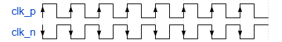
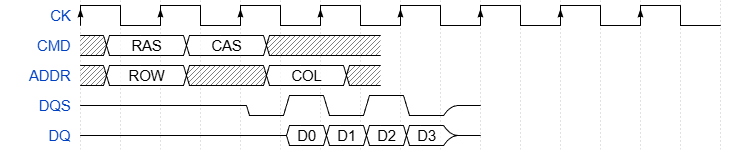
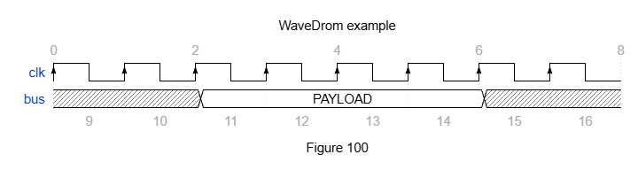
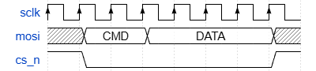
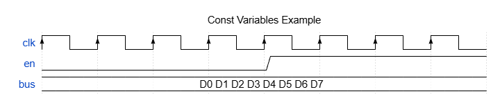
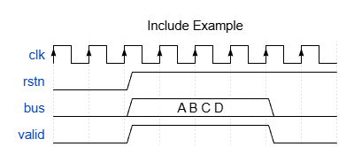
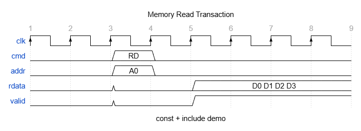

# WaveDSL Sample Gallery

WaveDSL ソースコード、生成される WaveDrom JSON、レンダリング済み波形を対応させたリファレンスです。

---

## 1. SPI Bus — `simple_spi`

基本的なシグナル定義（`clock`, `data`, `high`, `low`, `x`）のサンプル。

**WaveDSL** ([simple_spi.wdsl](../samples/simple_spi.wdsl))

```
// シンプルなSPIタイミング
signal sclk  clock(8)
signal mosi  x(1) data(2, "CMD") data(4, "DATA") x(1)
signal miso  x(1) data(2, "ACK") data(4, "0xFF") x(1)
signal cs_n  high(1) low(6) high(1)
```

**WaveDrom JSON** ([simple_spi.json](../samples/simple_spi.json))

```json
{
  "signal": [
    { "name": "sclk", "wave": "PPPPPPPP" },
    { "data": ["CMD", "DATA"], "name": "mosi", "wave": "x=.=...x" },
    { "data": ["ACK", "0xFF"], "name": "miso", "wave": "x=.=...x" },
    { "name": "cs_n", "wave": "10.....1" }
  ]
}
```

**波形**


---

## 2. Burst Transfer — `burst`

`repeat` を使ったバースト転送パターンの表現。

**WaveDSL** ([burst.wdsl](../samples/burst.wdsl))

```
// バースト転送
signal clk   clock(18)
signal burst x(1) repeat(4, data(2, "0xAB") data(2, "0xCD")) x(1)
signal valid low(1) repeat(4, high(4)) low(1)
```

**WaveDrom JSON** ([burst.json](../samples/burst.json))

```json
{
  "signal": [
    { "name": "clk", "wave": "PPPPPPPPPPPPPPPPPP" },
    { "data": ["0xAB","0xCD","0xAB","0xCD","0xAB","0xCD","0xAB","0xCD"],
      "name": "burst", "wave": "x=.=.=.=.=.=.=.=.x" },
    { "name": "valid", "wave": "01...1...1...1...0" }
  ]
}
```

**波形**


---

## 3. AXI Group — `axi_group`

`group` によるバス信号のグルーピング（2階層ネスト）。`data` の `color` キーワード引数も使用。

**WaveDSL** ([axi_group.wdsl](../samples/axi_group.wdsl))

```
// バスインターフェース
group "AXI" {
    group "Write Channel" {
        signal awvalid low(2) high(2) low(4)
        signal awready low(3) high(1) low(4)
        signal wdata   x(2) data(2, "0xDEAD", color=2) x(4)
    }
    group "Read Channel" {
        signal arvalid low(4) high(2) low(2)
        signal rdata   x(4) data(2, "0xBEEF", color=3) x(2)
    }
}
```

**WaveDrom JSON** ([axi_group.json](../samples/axi_group.json))

```json
{
  "signal": [
    ["AXI",
      ["Write Channel",
        { "name": "awvalid", "wave": "0.1.0..." },
        { "name": "awready", "wave": "0..10..." },
        { "data": ["0xDEAD"], "name": "wdata", "wave": "x.2.x..." }
      ],
      ["Read Channel",
        { "name": "arvalid", "wave": "0...1.0." },
        { "data": ["0xBEEF"], "name": "rdata", "wave": "x...3.x." }
      ]
    ]
  ]
}
```

**波形**


---

## 4. Falling Clock — `falling_clock`

`clock` の `edge` キーワード引数で立ち上がり／立ち下がりを制御。

**WaveDSL** ([falling_clock.wdsl](../samples/falling_clock.wdsl))

```
signal clk_p clock(8, edge=rising)
signal clk_n clock(8, edge=falling)
```

**WaveDrom JSON** ([falling_clock.json](../samples/falling_clock.json))

```json
{
  "signal": [
    { "name": "clk_p", "wave": "PPPPPPPP" },
    { "name": "clk_n", "wave": "NNNNNNNN" }
  ]
}
```

**波形**



---

## 5. DDR Timing — `ddr_timing`

`period` と `phase` シグナル属性による DDR タイミング表現。

**WaveDSL** ([ddr_timing.wdsl](../samples/ddr_timing.wdsl))

```
// DDR timing with period and phase
signal CK   clock(8) period=2
signal CMD   x(1) data(2, "RAS") data(2, "CAS") x(3) phase=0.5
signal ADDR  x(1) data(2, "ROW") x(2) data(2, "COL") x(1) phase=0.5
signal DQS   z(4) low(1) high(1) low(1) high(1) low(1) z(1)
signal DQ    z(5) data(1, "D0") data(1, "D1") data(1, "D2") data(1, "D3") z(1)
```

**WaveDrom JSON** ([ddr_timing.json](../samples/ddr_timing.json))

```json
{
  "signal": [
    { "name": "CK", "period": 2, "wave": "PPPPPPPP" },
    { "data": ["RAS", "CAS"], "name": "CMD", "phase": 0.5, "wave": "x=.=.x.." },
    { "data": ["ROW", "COL"], "name": "ADDR", "phase": 0.5, "wave": "x=.x.=.x" },
    { "name": "DQS", "wave": "z...01010z" },
    { "data": ["D0", "D1", "D2", "D3"], "name": "DQ", "wave": "z....====z" }
  ]
}
```

**波形**



---

## 6. Head / Foot / Config — `head_foot_config`

`head`, `foot`, `config` ブロックによるメタデータ設定。

**WaveDSL** ([head_foot_config.wdsl](../samples/head_foot_config.wdsl))

```
head {
    text = "WaveDrom example"
    tick = 0
    every = 2
}

foot {
    text = "Figure 100"
    tock = 9
}

config {
    hscale = 2
}

signal clk clock(8)
signal bus x(2) data(4, "PAYLOAD") x(2)
```

**WaveDrom JSON** ([head_foot_config.json](../samples/head_foot_config.json))

```json
{
  "config": { "hscale": 2 },
  "foot": { "text": "Figure 100", "tock": 9 },
  "head": { "every": 2, "text": "WaveDrom example", "tick": 0 },
  "signal": [
    { "name": "clk", "wave": "PPPPPPPP" },
    { "data": ["PAYLOAD"], "name": "bus", "wave": "x.=...x." }
  ]
}
```

**波形**



---

## 7. Complete Example — `complete_example`

最小構成のシグナル定義。

**WaveDSL** ([complete_example.wdsl](../samples/complete_example.wdsl))

```
signal sclk  clock(8)
signal mosi  x(1) data(2, "CMD") data(4, "DATA") x(1)
signal cs_n  high(1) low(6) high(1)
```

**WaveDrom JSON** ([complete_example.json](../samples/complete_example.json))

```json
{
  "signal": [
    { "name": "sclk", "wave": "PPPPPPPP" },
    { "data": ["CMD", "DATA"], "name": "mosi", "wave": "x=.=...x" },
    { "name": "cs_n", "wave": "10.....1" }
  ]
}
```

**波形**



---

## 8. Const Variables — `const_variables`

`const` で定数を定義し、`$NAME` で参照。パラメータの一元管理が可能。

**WaveDSL** ([const_variables.wdsl](../samples/const_variables.wdsl))

```
// Constants allow reusing values across signals
const CYCLES = 8
const HALF = 4
const SCALE = 2

config {
    hscale = $SCALE
}

signal clk     clock($CYCLES)
signal en      low($HALF) high($HALF)
signal bus     data($CYCLES, "D0 D1 D2 D3 D4 D5 D6 D7")

head {
    text = "Const Variables Example"
}
```

**WaveDrom JSON** ([const_variables.json](../samples/const_variables.json))

```json
{
  "config": { "hscale": 2 },
  "head": { "text": "Const Variables Example" },
  "signal": [
    { "name": "clk", "wave": "PPPPPPPP" },
    { "name": "en", "wave": "0...1..." },
    { "data": ["D0 D1 D2 D3 D4 D5 D6 D7"], "name": "bus", "wave": "=......." }
  ]
}
```

**波形**



---

## 9. Include — `include_example`

`include` で別ファイルのシグナル定義を取り込み。共通シグナル（clk, rstn）を再利用。

**共通ファイル** ([common_signals.wdsl](../samples/common_signals.wdsl))

```
// Common signal definitions shared across designs
signal clk  clock(8)
signal rstn low(2) high(6)
```

**WaveDSL** ([include_example.wdsl](../samples/include_example.wdsl))

```
// Include example: reuse common signals from another file
include "common_signals.wdsl"

signal bus   low(2) data(4, "A B C D") low(2)
signal valid low(2) high(4) low(2)

head {
    text = "Include Example"
}
```

**WaveDrom JSON** ([include_example.json](../samples/include_example.json))

```json
{
  "head": { "text": "Include Example" },
  "signal": [
    { "name": "clk", "wave": "PPPPPPPP" },
    { "name": "rstn", "wave": "0.1....." },
    { "data": ["A B C D"], "name": "bus", "wave": "0.=...0." },
    { "name": "valid", "wave": "0.1...0." }
  ]
}
```

**波形**



---

## 10. Const + Include — `mem_read`

`const` と `include` を組み合わせた実践的なサンプル。パラメータファイルを外部化し、メモリリードトランザクションを記述。

**パラメータファイル** ([mem_params.wdsl](../samples/mem_params.wdsl))

```
// Shared constants for memory interface signals
const TOTAL = 8
const LATENCY = 2
const BURST = 4
```

**WaveDSL** ([mem_read.wdsl](../samples/mem_read.wdsl))

```
// Memory read transaction using shared parameters
include "mem_params.wdsl"

config {
    hscale = 2
}

head {
    text = "Memory Read Transaction"
    tick  = 1
}

signal clk   clock($TOTAL)
signal cmd   low($LATENCY) data(1, "RD") low(5)
signal addr  low($LATENCY) data(1, "A0") low(5)
signal rdata low($LATENCY) low($LATENCY) data($BURST, "D0 D1 D2 D3")
signal valid low($LATENCY) low($LATENCY) high($BURST)

foot {
    text = "const + include demo"
}
```

**WaveDrom JSON** ([mem_read.json](../samples/mem_read.json))

```json
{
  "config": { "hscale": 2 },
  "foot": { "text": "const + include demo" },
  "head": { "text": "Memory Read Transaction", "tick": 1 },
  "signal": [
    { "name": "clk", "wave": "PPPPPPPP" },
    { "data": ["RD"], "name": "cmd", "wave": "0.=0...." },
    { "data": ["A0"], "name": "addr", "wave": "0.=0...." },
    { "data": ["D0 D1 D2 D3"], "name": "rdata", "wave": "0.0.=..." },
    { "name": "valid", "wave": "0.0.1..." }
  ]
}
```

**波形**



---

## サンプル一覧

| # | サンプル | 機能 | ファイル |
|---|---------|------|---------|
| 1 | SPI Bus | 基本シグナル | [wdsl](../samples/simple_spi.wdsl) / [json](../samples/simple_spi.json) |
| 2 | Burst Transfer | `repeat` | [wdsl](../samples/burst.wdsl) / [json](../samples/burst.json) |
| 3 | AXI Group | `group`, `color` | [wdsl](../samples/axi_group.wdsl) / [json](../samples/axi_group.json) |
| 4 | Falling Clock | `edge=falling` | [wdsl](../samples/falling_clock.wdsl) / [json](../samples/falling_clock.json) |
| 5 | DDR Timing | `period`, `phase` | [wdsl](../samples/ddr_timing.wdsl) / [json](../samples/ddr_timing.json) |
| 6 | Head/Foot/Config | `head`, `foot`, `config` | [wdsl](../samples/head_foot_config.wdsl) / [json](../samples/head_foot_config.json) |
| 7 | Complete Example | 最小構成 | [wdsl](../samples/complete_example.wdsl) / [json](../samples/complete_example.json) |
| 8 | Const Variables | `const`, `$NAME` | [wdsl](../samples/const_variables.wdsl) / [json](../samples/const_variables.json) |
| 9 | Include | `include` | [wdsl](../samples/include_example.wdsl) / [json](../samples/include_example.json) |
| 10 | Const + Include | `const` + `include` 連携 | [wdsl](../samples/mem_read.wdsl) / [json](../samples/mem_read.json) |
